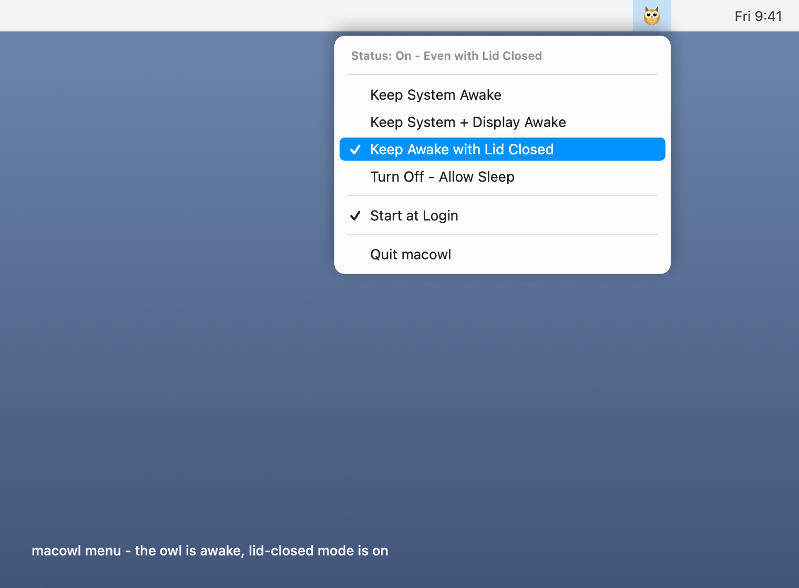

<p align="center">
  
</p>

<h1 align="center">macowl</h1>

<p align="center">A tiny owl in your menu bar that keeps your Mac awake.</p>

<p align="center">
  
  
  
</p>

A tiny menu bar app that keeps your Mac awake. It sits quietly in the menu bar
as a small owl. When the owl is awake (eyes open), your Mac will not go to
sleep. When the owl is sleeping (eyes closed), everything is normal.

That is the whole idea. No settings window, no Dock icon, nothing heavy. Just
one owl in the menu bar.

macowl is a free and open source way to **keep your Mac awake** and **stop your
MacBook from sleeping when you close the lid**. If you have looked for a simple
**caffeine app for Mac**, or an **Amphetamine, Caffeine, KeepingYouAwake or
Lungo alternative**, macowl does the same job with one extra trick: it can keep
the system running with the **lid closed (clamshell mode)**, which is perfect
for long jobs and background agents.

## What it looks like

<p align="center">
  
</p>

One click on the owl gives you everything: the current status, the four modes,
Start at Login, and Quit. A tick shows which mode is on, and the owl opens its
eyes whenever your Mac is being kept awake.

## Made for developers who keep agents and jobs running

This is the main reason the **Even with Lid Closed** mode exists.

More and more of us run things that must keep going even after we shut the
laptop and walk away:

- **AI coding agents** grinding through a long task while you step out.
- **Long builds, test suites and local CI runs** that take a while.
- **Training runs, data jobs, big uploads or downloads.**
- **Servers, dev tunnels or background services** you are hosting from your Mac.
- **SSH sessions** into your machine that must stay reachable.

Normally, closing a MacBook lid puts everything to sleep, and your agent or job
just stops dead. With macowl set to **On - Even with Lid Closed**, you can shut
the lid, drop the laptop in your bag, and the work keeps running. The screen is
off (the lid is closed, after all), but the CPU, the network and all your
processes stay alive.

Turn it on before you close the lid, and turn it off when you are done so your
Mac can sleep and save battery again. The full details, including the one-time
admin password and how macowl keeps you safe, are in
[Keeping the Mac awake with the lid closed](#keeping-the-mac-awake-with-the-lid-closed).

## Why I made this

Many times my Mac goes to sleep when I do not want it to. For example, a long
download is running, or a build is going on, or I just want the music to keep
playing. The usual trick is the `caffeinate` command in the terminal, but I
wanted something simple that I can click from the menu bar.

So macowl does exactly that, and it does it the clean way. It uses the proper
macOS power assertions through IOKit. It does not run any extra `caffeinate`
process in the background.

## The modes, and when to use each

macowl has four states. Click the owl and pick one. It takes effect right away
and a tick appears next to the active mode.

| Mode | What it does | When to use it |
|------|--------------|----------------|
| **Off** (Turn Off - Allow Sleep) | Normal sleep. The owl closes its eyes. | When you are done and want your Mac to behave normally again. |
| **On - System** | The Mac will not idle-sleep, but the screen can still dim and switch off. | Downloads, builds or music where you do not need the screen on. Saves the most battery of the three "on" modes. |
| **On - System + Display** | The Mac and the screen both stay fully awake. | Presentations, dashboards, reading, or watching something without touching the trackpad. |
| **On - Even with Lid Closed** | The Mac keeps running even after you shut the lid. | Agents, long jobs and servers that must keep going while the laptop is closed. Needs your admin password (see [below](#keeping-the-mac-awake-with-the-lid-closed)). |

Only one mode is active at a time. Picking a new mode switches to it. Picking
the active mode again, or choosing **Turn Off - Allow Sleep**, returns you to
normal sleep.

### How to use it, step by step

1. Click the **owl icon** in the menu bar (top right of your screen).
2. The first line shows the current **Status**.
3. Click the mode you want. A tick marks the active mode and the owl opens its
   eyes.
4. For **Even with Lid Closed** only, type your admin password when macOS asks.
5. When you are finished, click **Turn Off - Allow Sleep** so your Mac can sleep
   normally again and save battery.

### Start at Login

Turn on **Start at Login** and macowl opens by itself every time you log in, so
the owl is always there when you need it. Turn it off any time from the same
menu.

## Installing

### The easy way (DMG)

1. Go to the [Releases](../../releases) page.
2. Download the latest `macowl-x.y.z.dmg`.
3. Open the DMG and drag **macowl** into your **Applications** folder.
4. Open it. Look for the owl in your menu bar at the top right.

Because the app is signed only with an ad-hoc signature (not a paid Apple
developer certificate), macOS may show a warning the first time, something like
"macowl is from an unidentified developer" or "Apple could not verify it is
free of malware". This is expected for a small open source app that is not yet
notarized. To open it: **right click (or Control click) the app, choose Open,
then click Open again** in the dialog. You only have to do this once.

> ### Want to help remove that warning?
>
> The only reason macOS shows the warning is that macowl is not signed and
> notarized with a paid **Apple Developer account**, which costs 99 USD a year.
>
> If you like macowl and find it useful, please consider
> **[sponsoring the project](https://github.com/sponsors/rgcsekaraa)**. The money
> goes directly towards:
>
> - an **Apple Developer account**, so future releases are properly signed and
>   notarized and this warning goes away for everyone, and
> - **ongoing maintenance** to keep macowl working on new versions of macOS.
>
> Even a small one-time sponsorship genuinely helps. Thank you.

### Building it yourself

You need a Mac with the Xcode command line tools. If you can run `swiftc`, you
are ready.

```sh
git clone https://github.com/rgcsekaraa/macowl.git
cd macowl
./build.sh
```

`build.sh` compiles the app, makes the icon, installs it into `/Applications`
and opens it. That is all.

### Making a DMG to share

If you want to make your own DMG (for example to give it to a friend), run:

```sh
./build-dmg.sh
```

This builds the app into the `dist` folder and creates `dist/macowl-1.0.0.dmg`.
It does not touch `/Applications` or your running copy.

## Uninstalling

macowl is just one app, so removing it is easy.

1. Click the owl and choose **Quit macowl**.
2. If you turned on Start at Login, turn it off first from the menu, or remove
   macowl from **System Settings > General > Login Items**.
3. Move **macowl** from your **Applications** folder to the Trash.

If you ever used the lid closed state and want to be fully sure your sleep
setting is back to normal, run this once:

```sh
sudo pmset -a disablesleep 0
```

## Tip

You do not have to open the menu to check the state. The owl itself tells you:
eyes open means a keep-awake mode is on, eyes closed means normal sleep. Hover
on the owl to see the exact status in a tooltip.

## Keeping the Mac awake with the lid closed

This one is different from the other states, so please read this part.

When you close the lid of a MacBook, macOS goes to sleep. There is no power
assertion that can stop this. The only reliable way to keep the Mac running
with the lid shut is the system setting `pmset disablesleep`. macowl uses this
setting for the **On - Even with Lid Closed** state.

A few important points:

1. **It asks for your admin password.** Turning this state on and off changes a
   system setting, so macOS asks for your password each time. This is normal and
   there is no way around it without installing a background helper tool, which
   macowl does not do on purpose, to keep things simple and safe.

2. **It stops all sleep, not only lid sleep.** While this state is on, the Mac
   will not sleep at all, even when the lid is open and idle. That is the nature
   of the system setting.

3. **The screen will be off when the lid is closed.** This is obvious, but worth
   saying. The lid is shut, so the screen is off. But the CPU, the network, your
   downloads and everything else keep running.

4. **macowl cleans up after itself.** When you turn this state off, or quit
   macowl, the setting is put back to normal. If macowl is force quit or crashes
   while this state is on, the setting can stay on. To handle this, macowl keeps
   a small marker file and checks it the next time it opens. If it finds that the
   Mac was left awake by mistake, it will ask you whether to keep it awake or to
   restore normal sleep. So your Mac will not get stuck awake forever.

If you ever want to reset this setting by hand, you can run this in the
terminal:

```sh
sudo pmset -a disablesleep 0
```

## Questions people ask

**Does this drain my battery?**
Yes, keeping the Mac awake uses more power than letting it sleep, especially the
lid closed state. Use it when you need it and turn it off after.

**Will it stop my screen saver also?**
The display states stop the screen from sleeping, so the screen saver may not
start. The plain System state does not touch the display.

**Does it run any background process like caffeinate?**
No. macowl uses IOKit power assertions directly. The only system command it runs
is `pmset`, and only for the lid closed state.

**Why does it want my password?**
Only for the lid closed state, because that changes a system setting. The other
states do not need any password.

## How it works, in short

For the curious, here is the simple version:

- For the System and Display states, macowl creates an IOKit power assertion
  (`kIOPMAssertPreventUserIdleSystemSleep` or
  `kIOPMAssertPreventUserIdleDisplaySleep`). This is the clean, official way to
  ask macOS to stay awake. macowl holds only one assertion at a time.
- For the lid closed state, there is no assertion that works, so macowl flips
  the `pmset disablesleep` system setting. To stay safe, it remembers this with
  a marker file and checks it on the next launch.

The whole app is a single Swift file, `main.swift`, and the icon is drawn in
code in `makeicon.swift`. No frameworks, no dependencies.

## Contributing

Pull requests and ideas are welcome. Please see
[CONTRIBUTING.md](CONTRIBUTING.md) for how to build, test and send changes.

Please also read the [Code of Conduct](CODE_OF_CONDUCT.md) and the
[Changelog](CHANGELOG.md).

## Thanks

Thank you for using macowl. It is a small app made with care. If it helps you,
a star on the repo would make my day.

## License

macowl is open source under the [MIT license](LICENSE). You are free to use it,
change it, and share it. If you make something nice out of it, that is
wonderful.
